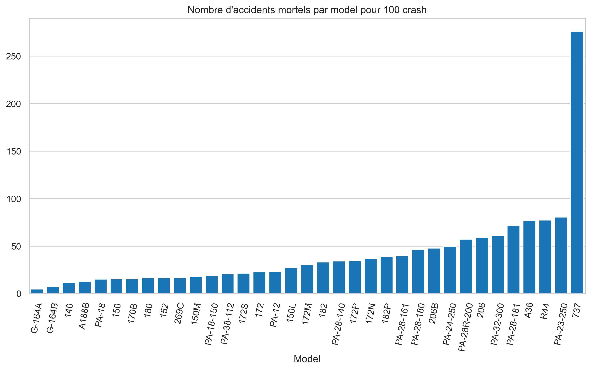

# Analyses des accidents d'avion (1962-2023)

## Contexte métier

Dans le cadre de sa stratégie de diversification, notre entreprise envisage d’entrer dans le secteur de l’aviation commerciale et privée. Elle souhaite acquérir une flotte d’avions afin de proposer des services de transport aérien. Toutefois, avant de lancer cette nouvelle activité, une étude des risques liés à l’exploitation aérienne est nécessaire.

En particulier, la direction souhaite identifier **les modèles d’avions les plus sûrs**, sur la base d’un historique fiable d’incidents et d’accidents. Nous avons été mandaté pour mener cette analyse en utilisant un ensemble de données fourni par le **National Transportation Safety Board (NTSB)**, couvrant les accidents d’aviation civile entre **1962 et 2023**.

Notre rôle est de :
- Nettoyer et préparer les données ;
- Identifier les types d’aéronefs les plus impliqués dans des accidents ;
- Mettre en évidence les causes récurrentes d’accidents ;
- Visualiser les données de manière claire et interactive ;
- Fournir des **recommandations exploitables** à la division aéronautique pour orienter ses **choix d’acquisition**.

Cette analyse permettra à l’entreprise de limiter les risques humains, financiers et opérationnels associés à cette nouvelle activité, tout en assurant un **niveau de sécurité optimal** pour ses futurs clients.

## Contenu du projet
- `notebooks` : Notebooks Jupyter aveec l'analyse complète
- `data` : Données brutes [AviationData.csv](https://raw.githubusercontent.com/MackSH/Phase-1-project/refs/heads/main/AviationData.csv), [USState_Codes.csv](https://raw.githubusercontent.com/MackSH/Phase-1-project/refs/heads/main/USState_Codes.csv)
- `README.md` : Ce fichier
- `requirements.txt` : Librairies à installer pour reproduire le projet

## Installation
```bash

# Clone le repo
git clone https://github.com/MackSH/Phase-1-project.git
cd Phase 1 project

# Crée un environnement virtuel (optionnel mais pro)
python -m venv env
source env/bin/activate   ou env\Scripts\activate sous Windows

# Installe les packages
pip install -r requirements.txt
```

## Analyses



Graphique affichant le taux d'accidents mortels par modèle
<br><br><br>


Graphique affichant le taux d'accidents mortels par modèle
<br><br><br>


<br><br><br>

## Mes recommandation

### Résumé des principales observations
- Les moteurs Reciprocating et Turbo Shaft affichent les taux de mortalité les plus faibles.
- Certains modèles d’avions comme le 152 et le 172 du constructeur Cessna ont une gravité d’accidents très basse, même avec un nombres d’incidents relativement élevé – Preuve de robustesse.
- Les constructeur Cesnna, Piper montrent un historique d’accidents maîtrisé avec une tendance à la baisse ces 10 dernières années.


### Recommandations stratégiques
1. Privilégier les modèles à moteur Reciprocating
    - Ce sont les moteurs qui présentent les meilleurs scores de sécurité sur le long terme.
    - Idéal pour les petits trajets régionaux.
    <br>

2. Éviter (ou surveiller) les modèles avec moteurs Turbo Fan dans une première phase
    - Ce type de moteur présente une gravité d'accident très élevée.
    Il est plus courant sur les gros porteurs.
    - À réserver pour une phase d'expansion, avec un budget sécurité + formation conséquent.
    <br>

3. Choisir des modèles ayant un historique d’usage dans des contextes similaires
    -  Rechercher des modèles utilisés dans des régions ou segments similaires pour minimiser les incertitudes.


